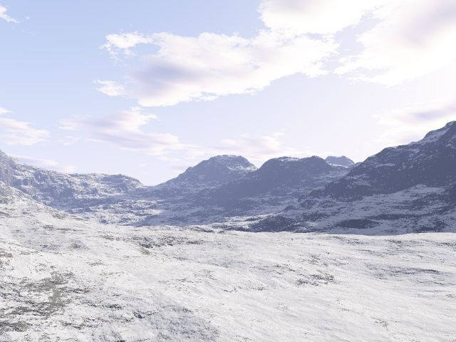

<div align="center">

## VB Snow Screen Saver Version\!


</div>

### Description

This is an exclusive, screen saver version of the VB Snow program! I have been testing it as my default screen saver for a couple days now, and it works great! There is no config screen for it, but it works just like a normal screen saver should!

I added full screen support (640x480), real time rotating snowflakes (done with calculations, not different pictures, real-time mask generation, and all sorts of nifty stuff!

I fixed the full screen support to work much better, and added in multiple background support! You can add your own backgrounds in, just edit the backgrnd.dat file! Make sure they are 640x480 also, or it doesn't work well.

This new version also adds in support to make this program work as a screen saver! You can right click the .SCR file included in this zip, hit Install, and it works just like a normal screen saver! (Minus the password protection)
 
### More Info
 


<span>             |<span>
---                |---
**Submitted On**   |1999-11-26 14:05:52
**By**             |[Dark Elf](https://github.com/Planet-Source-Code/PSCIndex/blob/master/ByAuthor/dark-elf.md)
**Level**          |Unknown
**User Rating**    |5.0 (5 globes from 1 user)
**Compatibility**  |VB 5\.0, VB 6\.0
**Category**       |[Miscellaneous](https://github.com/Planet-Source-Code/PSCIndex/blob/master/ByCategory/miscellaneous__1-1.md)
**World**          |[Visual Basic](https://github.com/Planet-Source-Code/PSCIndex/blob/master/ByWorld/visual-basic.md)
**Archive File**   |[CODE\_UPLOAD2022\.zip](https://github.com/Planet-Source-Code/dark-elf-vb-snow-screen-saver-version__1-4190/archive/master.zip)

### API Declarations

```
SetPixel
SetPixelV
GetPixel
BitBLT
And Tons more!
```


